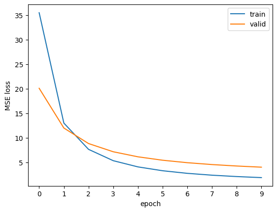

# pytorch_MF
Matrix Factorization implemented in pytorch and trained with Movielens-1m

### Download Movielens-1m
```
1. chmod 755 download.sh 
2. ./download.sh
```

### Model training 
```
1. pyenv local 3.11
2. poetry install
3. poetry run python src/pytorch_mf.py 
```

### Results
```
[epoch 1] train loss: 35.42764   valid loss: 19.94273
[epoch 2] train loss: 12.98360   valid loss: 11.89855
[epoch 3] train loss: 7.62695   valid loss: 8.75850
[epoch 4] train loss: 5.31953   valid loss: 7.10348
[epoch 5] train loss: 4.05926   valid loss: 6.08464
[epoch 6] train loss: 3.27678   valid loss: 5.39519
[epoch 7] train loss: 2.75007   valid loss: 4.89846
[epoch 8] train loss: 2.37511   valid loss: 4.52350
[epoch 9] train loss: 2.09697   valid loss: 4.23081
[epoch 10] train loss: 1.88396   valid loss: 3.99587
```


